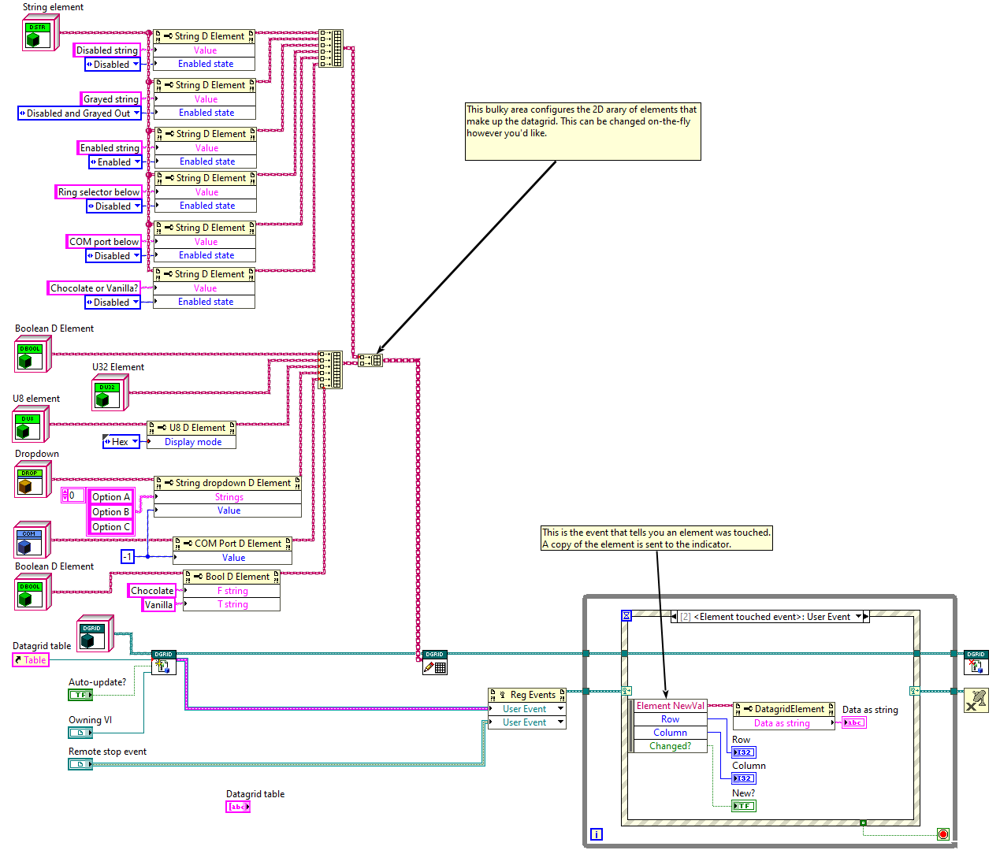

# The D Datagrid

This is a fully OOP-based Datagrid for LabVIEW based on the QControls toolkit. The QControls toolkit includes an example datagrid, but this differs from the example QControl in a few ways. (I'll admit I'm not 100% familiar with that one so forgive me if the below information is incomplete or incorrect.)

An overview of various features/differences between other datagrids:
1. **The D Datagrid is defined entirely on the block diagram.**

Other Datagrids use a Wizard to configure them. This is very helpful at edit time, but implementing it fully on the BD means it's entirely dynamic- meaning you can build it at runtime from a config file or even modify it during the execution of your program. This makes it a bit complex to set up, but it means you can add, remove, or reconfigure elements at runtime very easily using the same techniques you used to construct it in the first place. Want to change your Ring control to a Boolean? Just swap the elements at that location.

2. **This uses a Table control instead of a Multicolumn Listbox.**

Not necessarily better or worse, just different. I'd like to support multiple "base" controls eventually (like a tree control) but it's not planned at the moment.

3. **The underlying data storage is a 2D array of objects.**

Each element type being a class means you have total control over the data itself. Other Datagrids have an "integer" type, but here you can have an I32, a U16, or whatever you'd like. You can also have more complicated data types- you're not limited to what can be "shown" in a string or small image in a table. See the example types for more info.

4. **Data in the 2D array is stored exactly as LabVIEW stores it.**

This eliminates potential (very small) rounding errors in String to <type> conversions. For example, if you need a Float datatype, you can have a Float datatype- not a Float stored in a Double. This is important for "Get flattened data.vi", which returns a U8 array that contains your data. This is actually the reason I made this library; I needed exact byte-perfect data for all of the elements of a bunch of configuration parameters that would be sent through a checksum algorithm. If I simply used a U32 with a max coercion value of 256 to represent a U8, the byte pattern would be wrong and my checksum wouldn't work.

5. **The entire system is, of course, object oriented.**

If you want to make your own special datagrid viewer, you can override the main one and keep the data elements. By default, all "update" events have to return a generic DataGrid Element, variant, or string. By overriding the viewer, you can cast these generic events to specific events that could signal the owner VI exactly like you want to.

6. **Cells can be programmatically activated**

There is a "programmatic edit" functionality that programmatically triggers a mousedown event at a certain cell. This is a user event output from "New D_Datagrid"; send a coordinate to that user event, and the element will act like you clicked on it. This can be useful for auto-triggering a dropdown, for example.

## Base datatypes

The following datatypes are supported out of the box:

- String dropdown box (i.e., a ring control)  
- COM port selector (implemented as an override of the String dropdown)  
- Boolean (acts like a button)  
- String  
- Float  
- Double  
- U8  
- U32  

(The numerics are set up as another subclass so you could implement e.g., an I32 easily enough.)

## Known issues:

- There is a bug that makes the first click or two show up slightly in the wrong spot. I can't reliably reproduce it but it's only the first click or two.  
- Documentation is... about on-par for user submitted stuff. Using the datagrid out of the box is reasonably documented (IMHO) but overriding and creating your own classes is a bit more involved, and the documentation is basically "just refer to the existing datatypes". Apologies for that.

Here's the example VI with a couple comments- it's bulky to start but you can easily hide this in a subVI, or wrap it up in your own derived class:

